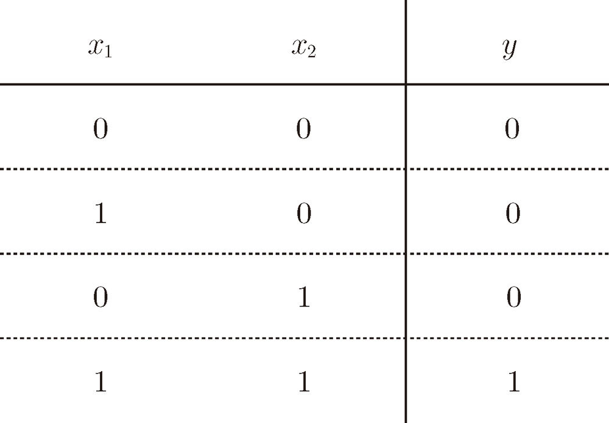
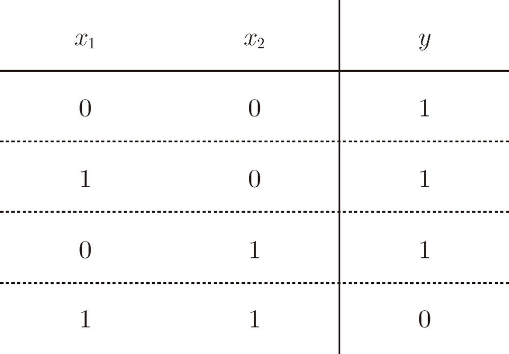
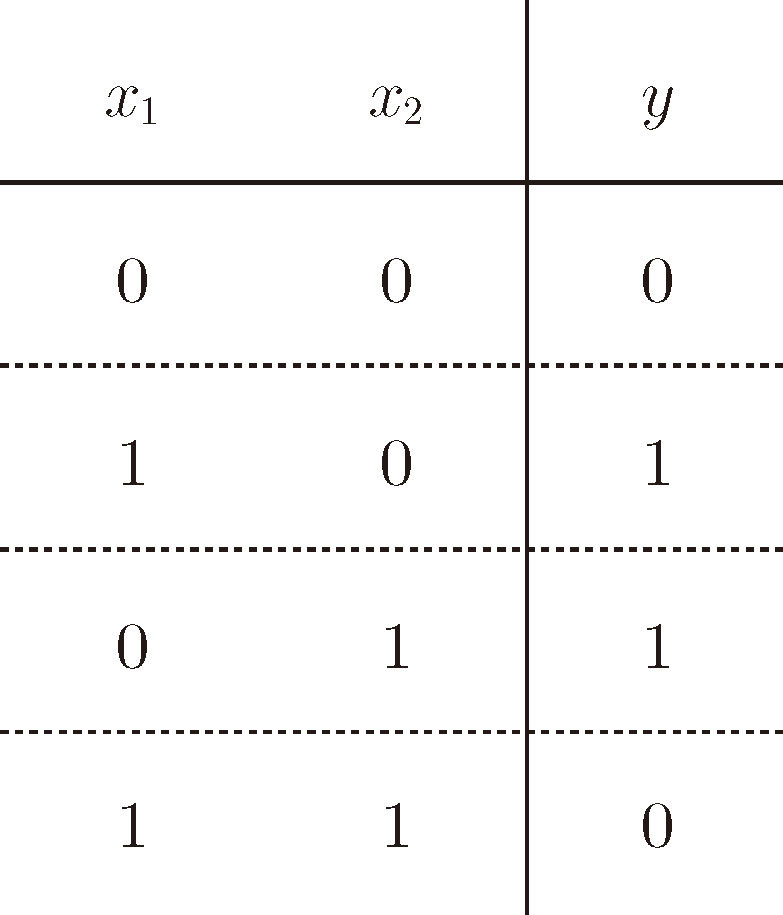
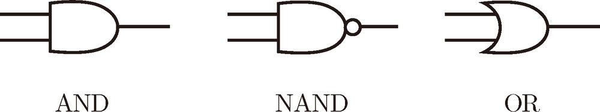
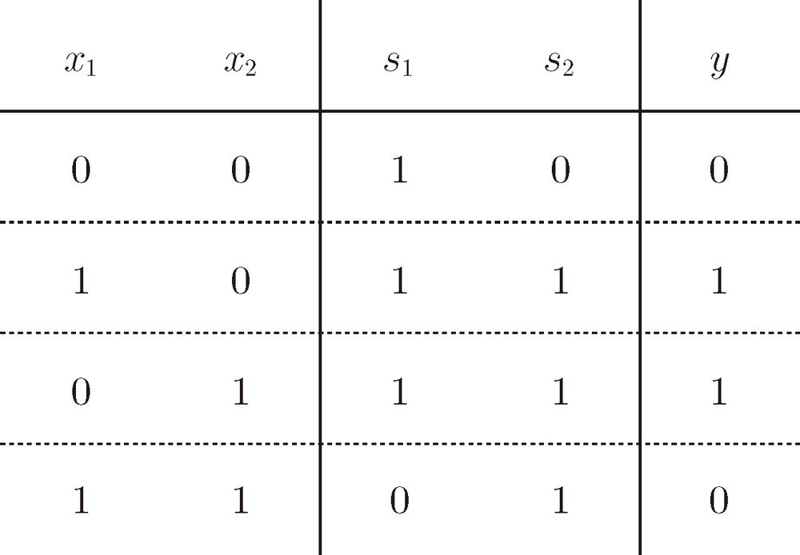

== 感知机
=== 感知机是什么？
感知机接收多个输入信号，输出一个信号。这里所说的“信号”可以想象成电流或河流那样具备“流动性”的东西。像电流流过导线，向前方输送电子一样，感知机的信号也会形成流，向前方输送信息。但是，和实际的电流不同的是，感知机的信号只有“流 / 不流”（1/0）两种取值。在本书中，0 对应“不传递信号”，1 对应“传递信号”。

图 2-1 是一个接收两个输入信号的感知机的例子。、 是输入信号，y 是输出信号，、 是权重（w 是 weight的首字母）。图中的○称为“神经元”或者“节点”。输入信号被送往神经元时，会被分别乘以固定的权重（w1x1、w2x2）。神经元会计算传送过来的信号的总和，只有当这个总和超过了某个界限值时，才会输出 1。这也称为“神经元被激活”。这里将这个界限值称为阈值，用符号 θ 表示。
 
image::images/0616099334537527799928066484575062815882.jpg[title="图 2-1　有两个输入的感知机"]

感知机的运行原理只有这些！把上述内容用数学式来表示，就是式（2.1）。

image::images/App_2025-06-20_16-53-05.png[]

感知机的多个输入信号都有各自固有的权重，这些权重发挥着控制各个信号的重要性的作用。也就是说，权重越大，对应该权重的信号的重要性就越高。

=== 简单逻辑电路
==== 与门
与门（AND gate）

实际上，满足图 2-2 的条件的参数的选择方法有无数多个。比如，当  时，可以满足图 2-2 的条件。此外，当 (w1, w2, θ) 为 (0.5, 0.5, 0.8) 或者 (1.0, 1.0, 1.0)时，同样也满足与门的条件。设定这样的参数后，仅当  和  同时为 1 时，信号的加权总和才会超过给定的阈值 θ。

==== 与非门和或门
与非门（NAND gate）。NAND 是 Not AND 的意思，与非门就是颠倒了与门的输出。

要表示与非门，可以用 (w1, w2, θ) 这样的组合（其他的组合也是无限存在的）。实际上，只要把实现与门的参数值的符号取反，就可以实现与非门。

或门是“只要有一个输入信号是 1，输出就为 1”.

image::images/0616099334538155743981118064405332780251.jpg[]

=== 感知机的实现
==== 简单的实现
[source, python]
def AND(x1, x2):
    w1, w2, theta = 0.5, 0.5, 0.7    
    tmp = x1*w1 + x2*w2    
    if tmp <= theta:
        return 0
    elif tmp > theta:
        return 1

==== 导入权重和偏置
把式（2.1）的 θ 换成 -b，于是就可以用式（2.2）来表示感知机的行为。

式（2.1）和式（2.2）虽然有一个符号不同，但表达的内容是完全相同的。此处，b 称为偏置， w1和 w2 称为权重。如式（2.2）所示，感知机会计算输入信号和权重的乘积，然后加上偏置，如果这个值大于 0 则输出 1，否则输出 0。

[source, python]
def AND(x1, x2):
    x = np.array([x1, x2])
    w = np.array([0.5, 0.5])    
    b = -0.7    
    tmp = np.sum(w*x) + b    
    if tmp <= 0:
        return 0    
    else:       
        return 1

偏置 b 和权重w1、w2的作用是不一样的。具体地说，w1 和 w2 是控制输入信号的重要性的参数，而偏置是调整神经元被激活的容易程度（输出信号为 1的程度）的参数。比如，若 b 为 -0.1，则只要输入信号的加权总和超过 0.1，神经元就会被激活。但是如果 b 为 -20.0，则输入信号的加权总和必须超过 20.0，神经元才会被激活。像这样，偏置的值决定了神经元被激活的容易程度。

=== 感知机的局限性
==== 异或门
仅当 x1 或 x2 中的一方为 1 时，才会输出 1。

在坐标上表示

image::images/0616099334539907978759032752318503997686.jpg[title='图 2-8　使用曲线可以分开○和△']

感知机的局限性就在于它只能表示由一条直线分割的空间。图 2-8 这样弯曲的曲线无法用感知机表示。另外，由图 2-8 这样的曲线分割而成的空间称为非线性空间，由直线分割而成的空间称为线性
空间。

=== 多层感知机

异或门可以通过图 2-11 所示的配置来实现。这里，x1 和 x2 表示输入信号，y 表示输出信号。 和  是与非门和或门的输入，而与非门和或门的输出则是与门的输入。

image::images/0616099334541690637352135842178209962872.jpg[title='图 2-11　通过组合与门、与非门、或门实现异或门']

异或门的真值表

异或门的实现

[source, terminal]
def XOR(x1, x2):
    s1 = NAND(x1, x2)    
    s2 = OR(x1, x2)    
    y = AND(s1, s2)    
    return y

用感知机的表示方法（明确地显示神经元）来表示这个异或门，结果如图 2-13 所示。

image::images/0616099334542521368795157828404670316670.jpg[title='图 2-13　用感知机表示异或门']

异或门是一种多层结构的神经网络。这里，将最左边的一列称为第 0 层，中间的一列称为第 1 层，最右边的一列称为第 2 层。实际上，与门、或门是单层感知机，而异或门是 2 层感知机。叠加了多层的感知机也称为多层感知机（multi-layered perceptron）。