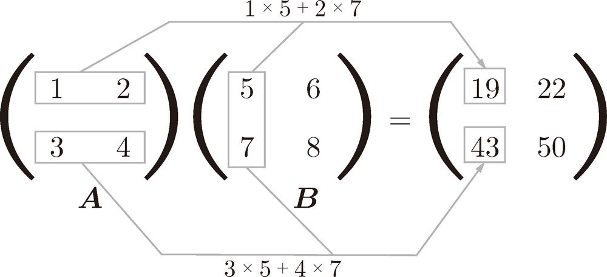
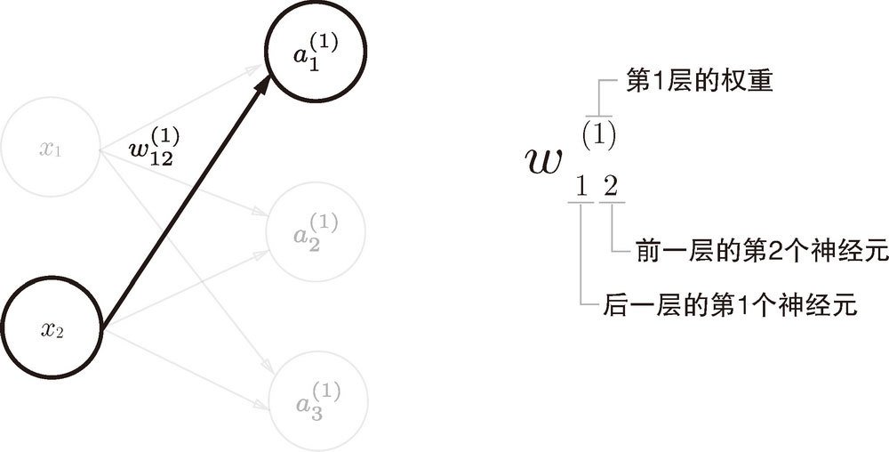
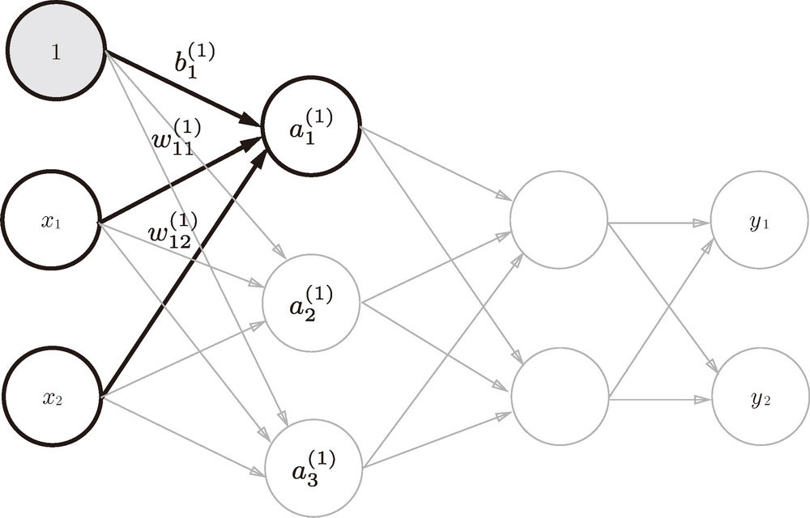
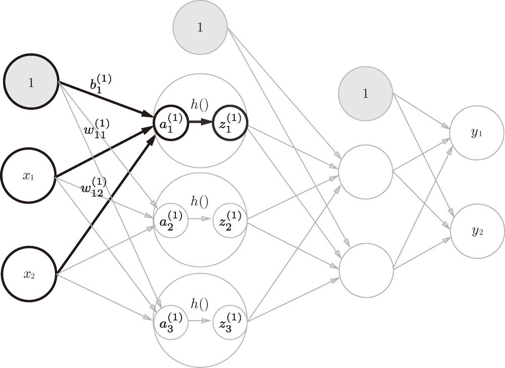

== 神经网络
关于感知机，既有好消息，也有坏消息。好消息是，即便对于复杂的函数，感知机也隐含着能够表示它的可能性。上一章已经介绍过，即便是计算机进行的复杂处理，感知机（理论上）也可以将其表示出来。坏消息是，设定权重的工作，即确定合适的、能符合预期的输入与输出的权重，现在还是由人工进行的。神经网络的一个重要性质是它可以自动地从数据中学习到合适的权重参数。

=== 从感知机到神经网络
用图来表示神经网络的话，如图 3-1 所示。我们把最左边的一列称为输入层，最右边的一列称为输出层，中间的一列称为中间层。中间层有时也称为隐藏层。“隐藏”一词的意思是，隐藏层的神经元（和输入层、输出层不同）肉眼看不见。

image::images\0616099334542720652325317491870209446299.jpg[title='图3-1 神经网络的例子']

复习感知机，关于输入信号、偏置参数、激活函数，与神经网络进行对比。

=== 激活函数
神经网络中经常使用的一个激活函数就是式（3.6）表示的 sigmoid 函数（sigmoid function）。

式（3.6）中的 exp(-x) 表示  的意思。e 是纳皮尔常数 2.7182 ...。

sigmoid 函数的实现:
[source, python]
def sigmoid(x):
    return 1 / (1 + np.exp(-x))

sigmoid 函数和阶跃函数的比较

image:images/061609933454549653813850227315607103054.jpg[title='图 3-8　阶跃函数与 sigmoid 函数（虚线是阶跃函数）']

观察图 3-8，首先注意到的是“平滑性”的不同。sigmoid 函数是一条平滑的曲线，输出随着输入发生连续性的变化。而阶跃函数以 0 为界，输出发生急剧性的变化。sigmoid 函数的平滑性对神经网络的学习具有重要意义。另一个不同点是，相对于阶跃函数只能返回 0 或 1，sigmoid 函数可以返回 0.731 ...、0.880 ... 等实数（这一点和刚才的平滑性有关）。也就是说，感知机中神经元之间流动的是 0 或 1 的二元信号，而神经网络中流动的是连续的实数值信号。

神经网络的激活函数必须使用非线性函数。因为使用线性函数的话，加深神经网络的层数就没有意义了。线性函数的问题在于，不管如何加深层数，总是存在与之等效的“无隐藏层的神经网络”。使用线性函数时，无法发挥多层网络带来的优势。因此，为了发挥叠加层所带来的优势，激活函数必须使用非线性函数。

 ReLU（Rectified Linear Unit）函数,在输入大于 0 时，直接输出该值；在输入小于等于 0 时，输出 0（图 3-9）。

 

 ReLU 函数可以表示为下面的式 (3.7)。

因此，ReLU 函数的实现也很简单，可以写成如下形式。
[source, python]
def relu(x):
    return np.maximum(0, x)

=== 多维数组的运算
用NumPy生成多维数组

[source, terminal]
----
>>> import numpy as np
>>> A = np.array([1, 2, 3, 4])
>>> print(A)
[1 2 3 4]
>>> np.ndim(A) # 数组的维数可以通过 np.ndim() 函数获得
1
>>> A.shape # ，数组的形状可以通过实例变量 shape 获得
(4,)
>>> A.shape[0]
4

>>> B = np.array([[1,2], [3,4], [5,6]])
>>> print(B)
[[1 2] [3 4] [5 6]]
>>> np.ndim(B)
2
>>> B.shape
(3, 2)
----

这里生成了一个 3 × 2 的数组 B。3 × 2 的数组表示第一个维度有 3 个元素，第二个维度有 2 个元素。另外，第一个维度对应第 0 维，第二个维度对应第 1 维（Python 的索引从 0 开始）。二维数组也称为矩阵（matrix）。如图 3-10 所示，数组的横向排列称为行（row），纵向排列称为列
（column）。

image:images/0616099334546242137898475677121733707306.jpg[]

绍矩阵（二维数组）的乘积。比如 2 × 2 的矩阵，其乘积可以像图 3-11 这样进行计算（按图中顺序进行计算是规定好了的）。

[source, terminal]
>>> A = np.array([[1,2], [3,4]])
>>> A.shape
(2, 2)
>>> B = np.array([[5,6], [7,8]])
>>> B.shape
(2, 2)
>>> np.dot(A, B)
array([[19, 22],       
        [43, 50]])

神经网络的内积

以图 3-14 中的简单神经网络为对象。这个神经网络省略了偏置和激活函数，只有权重。

image:images/0616099334547422586374482406421115800874.jpg[title='图 3-14　通过矩阵的乘积进行神经网络的运算']

[source, terminal]
>>> X = np.array([1, 2])
>>> X.shape
(2,)
>>> W = np.array([[1, 3, 5], [2, 4, 6]])
>>> print(W)
[[1 3 5] [2 4 6]]
>>> W.shape
(2, 3)
>>> Y = np.dot(X, W)
>>> print(Y)
[ 5  11  17]

=== 3 层神经网络的实现
如图 3-16 所示，权重和隐藏层的神经元的右上角有一个“(1)”，它表示权重和神经元的层号（即第 1 层的权重、第 1 层的神经元）。此外，权重的右下角有两个数字，它们是后一层的神经元和前一层的神经元的索引号。比如，w12 表示前一层的第 2 个神经元 x2 到后一层的第 1 个神经元 a1 的权重。权重右下角按照“后一层的索引号、前一层的索引号”的顺序排列。

从输入层到第 1 层的第 1 个神经元的信号传递过程，如图 3-17 所示。

图 3-17 中增加了表示偏置的神经元“1”。为了确认前面的内容，现在用数学式表示

如果使用矩阵的乘法运算，则可以将第 1 层的加权和表示成下面的式（3.9）。

其中

image:images/App_2025-07-16_16-31-54.png[]

下面我们用 NumPy 多维数组来实现式（3.9），这里将输入信号、权重、偏置设置成任意值。

[source, terminal]
----
X = np.array([1.0, 0.5])
W1 = np.array([[0.1, 0.3, 0.5], [0.2, 0.4, 0.6]])
B1 = np.array([0.1, 0.2, 0.3])

print(W1.shape) # (2, 3)
print(X.shape) # (2,)
print(B1.shape) # (3,)

A1 = np.dot(X, W1) + B1
----

观察第 1 层中激活函数的计算过程。如果把这个计算过程用图来表示的话，则如图 3-18 所示。

如图 3-18 所示，隐藏层的加权和（加权信号和偏置的总和）用 a 表示，被激活函数转换后的信号用 z 表示。此外，图中 h() 表示激活函数，这里我们使用的是 sigmoid 函数。用 Python 来实现，代码如下所示。
[source, terminal]
----
Z1 = sigmoid(A1)

print(A1) # [0.3, 0.7, 1.1]
print(Z1) # [0.57444252, 0.66818777, 0.75026011]
----

下面，我们来实现第 1 层到第 2 层的信号传递（图 3-19）。
[source, terminal]
----
W2 = np.array([[0.1, 0.4], [0.2, 0.5], [0.3, 0.6]])
B2 = np.array([0.1, 0.2])

print(Z1.shape) # (3,)
print(W2.shape) # (3, 2)
print(B2.shape) # (2,)

A2 = np.dot(Z1, W2) + B2
Z2 = sigmoid(A2)
----

image:images/0616099334550073055675891618468895162707.jpg[title='图 3-19　第 1 层到第 2 层的信号传递']

最后是第 2 层到输出层的信号传递（图 3-20）。输出层的实现也和之前的实现基本相同。不过，最后的激活函数和之前的隐藏层有所不同。
[source, terminal]
----
def identity_function(x):    
    return x
    
W3 = np.array([[0.1, 0.3], [0.2, 0.4]])
B3 = np.array([0.1, 0.2])

A3 = np.dot(Z2, W3) + B3
Y = identity_function(A3) # 或者Y = A3
----

这里我们定义了 identity_function() 函数（也称为“恒等函数”），并将其作为输出层的激活函数。图 3-20 中，输出层的激活函数用 σ() 表示，不同于隐藏层的激活函数 h()。

image:images/0616099334550268935946090496321234502906.jpg[title='图 3-20　从第 2 层到输出层的信号传递']

[TIP]
输出层所用的激活函数，要根据求解问题的性质决定。一般地，回归问题可以使用恒等函数，二元分类问题可以使用 sigmoid 函数，多元分类问题可以使用 softmax 函数。

整理代码，按照神经网络的实现惯例，只把权重记为大写字母 W1，其他的（偏置或中间结果等）都用小写字母表示。
[source, python]
----
def init_network():
    network = {}    
    network['W1'] = np.array([[0.1, 0.3, 0.5], [0.2, 0.4, 0.6]])    
    network['b1'] = np.array([0.1, 0.2, 0.3])    
    network['W2'] = np.array([[0.1, 0.4], [0.2, 0.5], [0.3, 0.6]])    
    network['b2'] = np.array([0.1, 0.2])    
    network['W3'] = np.array([[0.1, 0.3], [0.2, 0.4]])    
    network['b3'] = np.array([0.1, 0.2])    
    return network
    
def forward(network, x):    
    W1, W2, W3 = network['W1'], network['W2'], network['W3']    
    b1, b2, b3 = network['b1'], network['b2'], network['b3']    
    
    a1 = np.dot(x, W1) + b1    
    z1 = sigmoid(a1)    
    a2 = np.dot(z1, W2) + b2    
    z2 = sigmoid(a2)    
    a3 = np.dot(z2, W3) + b3    
    y = identity_function(a3)    
    return y

network = init_network()x = np.array([1.0, 0.5])
y = forward(network, x)
print(y) # [ 0.31682708 0.69627909]
----

=== 输出层的设计
神经网络可以用在分类问题和回归问题上，不过需要根据情况改变输出层的激活函数。一般而言，回归问题用恒等函数，分类问题用 softmax 函数。

[TIP]
机器学习的问题大致可以分为分类问题和回归问题。分类问题是数据属于哪一个类别的问题。比如，区分图像中的人是男性还是女性的问题就是分类问题。而回归问题是根据某个输入预测一个（连续的）数值的问题。比如，根据一个人的图像预测这个人的体重的问题就是回归问题（类似“57.4kg”这样的预测）。

恒等函数会将输入按原样输出，对于输入的信息，不加以任何改动地直接输出。因此，在输出层使用恒等函数时，输入信号会原封不动地被输出。另外，将恒等函数的处理过程用之前的神经网络图来表示的话，则如图 3-21 所示。和前面介绍的隐藏层的激活函数一样，恒等函数进行的转换处理可以用一根箭头来表示。

分类问题中使用的 softmax 函数可以用下面的式（3.10）表示。

用图表示 softmax 函数的话，如图 3-22 所示。图 3-22 中，softmax 函数的输出通过箭头与所有的输入信号相连。这是因为，从式（3.10）可以看出，输出层的各个神经元都受到所有输入信号的影响。

[source, python]
def softmax(a):
    exp_a = np.exp(a)    
    sum_exp_a = np.sum(exp_a)    
    y = exp_a / sum_exp_a    
    return y

上面的 softmax
 函数的实现虽然正确描述了式（3.10），但在计算机的运算上有一定的缺陷。这个缺陷就是溢出问题。softmax 函数的实现中要进行指数函数的运算，但是此时指数函数的值很容易变得非常大。比如， e10的值会超过 20000，e100 会变成一个后面有 40 多个 0 的超大值，e1000 的结果会返回一个表示无穷大的 inf。如果在这些超大值之间进行除法运算，结果会出现“不确定”的情况。

 softmax 函数的实现可以像式（3.11）这样进行改进。

 image:images/0616099334552120468688535407429993118240.jpg[]

 式（3.11）说明，在进行 softmax 的指数函数的运算时，加上（或者减去）某个常数并不会改变运算的结果。这里的 C' 可以使用任何值，但是为了防止溢出，一般会使用输入信号中的最大值。

 [source, python]
 def softmax(a):
    c = np.max(a)    
    exp_a = np.exp(a - c) # 溢出对策    
    sum_exp_a = np.sum(exp_a)    
    y = exp_a / sum_exp_a    
    return y

使用 softmax() 函数，可以按如下方式计算神经网络的输出。
[source, terminal]
>>> a = np.array([0.3, 2.9, 4.0])
>>> y = softmax(a)
>>> print(y)
[ 0.01821127  0.24519181  0.73659691]>>> np.sum(y)
1.0

softmax 函数的输出是 0.0 到 1.0 之间的实数。并且，softmax 函数的输出值的总和是 1。输出总和为 1 是 softmax 函数的一个重要性质。正因为有了这个性质，我们才可以把softmax 函数的输出解释为“概率”。上面的例子可以解释成 y[0] 的概率是 0.018（1.8 %），y[1] 的概率是 0.245（24.5 %），y[2] 的概率是 0.737（73.7 %）。从概率的结果来看，可以说“因为第 2 个元素的概率最高，所以答案是第 2 个类别”。而且，还可以回答“有 74 % 的概率是第 2 个类别，有 25 % 的概率是第 1 个类别，有 1 % 的概率是第 0 个类别”。也就是说，通过使用 softmax 函数，我们可以用概率的（统计的）方法处理问题。

[TIP]
求解机器学习问题的步骤可以分为“学习” 和“推理”两个阶段。首先，在学习阶段进行模型的学习 ，然后，在推理阶段，用学到的模型对未知的数据进行推理（分类）。如前所述，推理阶段一般会省略输出层的 softmax 函数。在输出层使用 softmax 函数是因为它和神经网络的学习有关系。

输出层的神经元数量需要根据待解决的问题来决定。对于分类问题，输出层的神经元数量一般设定为类别的数量。比如，对于某个输入图像，预测是图中的数字 0 到 9 中的哪一个的问题（10 类别分类问题），可以像图 3-23 这样，将输出层的神经元设定为 10 个。

如图 3-23 所示，在这个例子中，输出层的神经元从上往下依次对应数字 0, 1, .. ., 9。此外，图中输出层的神经元的值用不同的灰度表示。这个例子中神经元  颜色最深，输出的值最大。这表明这个神经网络预测的是  对应的类别，也就是“2”。

